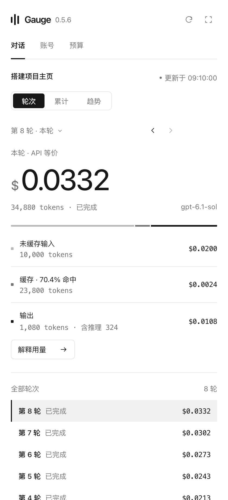
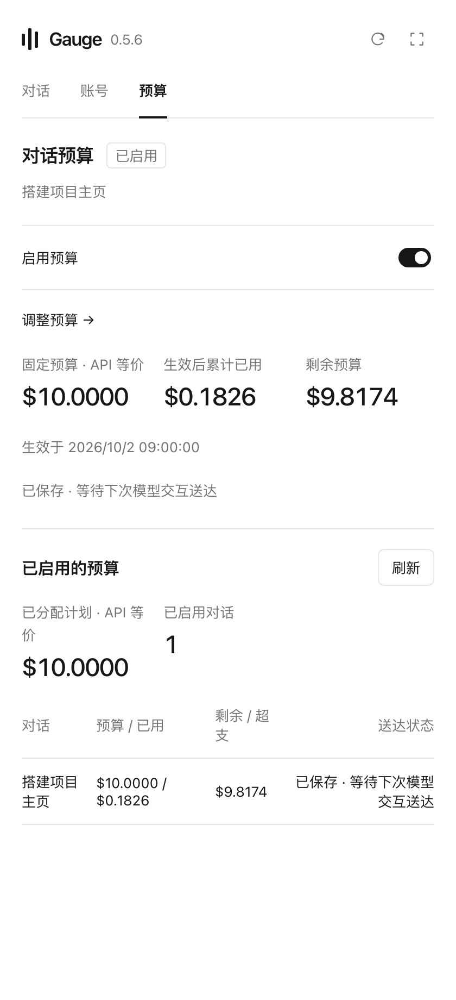
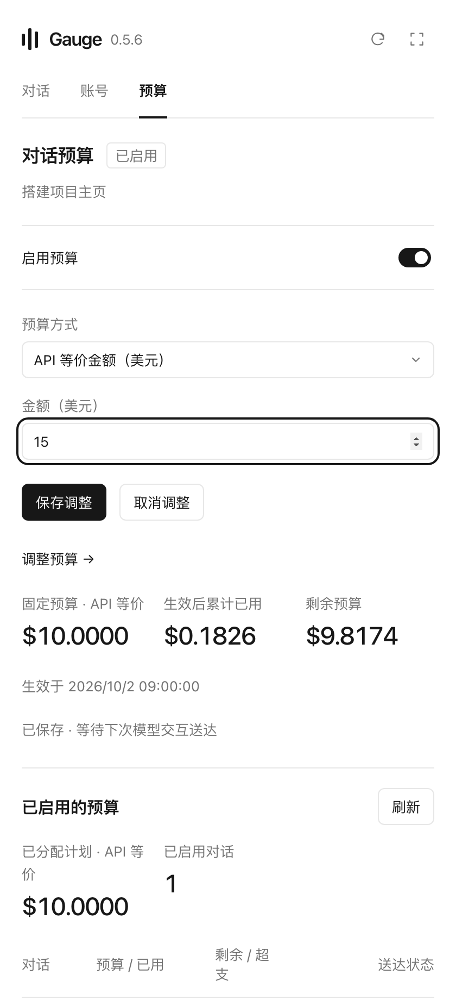

# Gauge · Codex Mac 侧边栏插件

Gauge 运行在 **Codex Mac 桌面端的侧边栏**，让你边聊天，边看这段对话花了多少 API 等价费用，并为当前对话设置预算。

核心功能：

- **每轮对话用了多少**：逐轮查看 tokens 和按 API 价格折算的费用，拆分未缓存输入、缓存和输出；可以回看历史轮次，也可以查看整段对话的累计用量和趋势。
- **对话预算**：给当前对话设置预算，在侧边栏查看生效后已用、剩余或超支金额。预算默认关闭，按需开启；它提供软预算提示，不会硬性中断对话。

**第一次用 Gauge？不需要事先下载插件，把下面这句话发给 Codex，让它完成安装。**

## 开始前

你需要一台搭载 Apple 芯片的 Mac（M1 或更新型号），以及已经安装、能正常使用的 Codex 桌面客户端。当前没有 Intel Mac、Windows 或 Linux 安装包。

安装 Gauge 不需要 GitHub 登录、API Key 或额外开发工具。

## 第一步：让 Codex 安装

复制整段话，发送到 Codex 的聊天里：

```text
我第一次使用 Gauge，还没有下载或安装这个插件。请按照下面的说明，帮我完成环境检查、下载、校验和安装，并确认插件已启用。安装后告诉我如何第一次打开它：
https://raw.githubusercontent.com/DHCFE/gauge-codex-plugin/main/INSTALL.md
```

Codex 会下载最新安装包并完成安装。若客户端弹出确认提示，按提示确认即可。

[完整的新用户安装说明](INSTALL.md) · [想手动安装？下载安装包](https://github.com/DHCFE/gauge-codex-plugin/releases/latest/download/Gauge-mac-arm64.zip)

## 第二步：第一次打开

安装完成后，新开一个聊天，发送：

```text
打开 Gauge 用量面板
```

如果面板未出现，让 Codex 检查插件是否已启用；若客户端提示需要重新打开，保存工作后重新打开客户端再试。

## 第三步：开始查看用量

- 在侧边栏的「对话 → 轮次」中查看本轮费用，或选择其他轮次回看；「累计」和「趋势」展示整段对话的消耗。
- 想控制这段对话的投入，在「预算」中开启预算，输入金额并保存，再查看已用和剩余。周容量估算可用时，也可以按百分比设置预算。
- 「账号」提供本机历史用量的补充汇总，便于回看其他对话。

新对话还没有用量记录时会显示等待状态，继续正常使用 Codex 后会自动更新。面板金额是按 API 价格估算的等价费用，不会因此向你额外扣费。本机统计不能包含其他设备上缺失的记录。

## 界面截图

下面是插件侧边栏界面的截图，使用演示数据。点击图片可以放大；预算图展示的是手动开启后的示例。

| 每轮对话的费用与 tokens | 对话预算：已用与剩余 | 设置或调整对话预算 |
| --- | --- | --- |
| <a href="docs/images/round-usage.png"></a> | <a href="docs/images/conversation-budget.png"></a> | <a href="docs/images/budget-setup.png"></a> |

## 之后有新版怎么办

打开面板会自动检查新版；出现「更新」按钮时，点击即可请求 agent 升级。[已有用户的更新说明](UPDATE.md) · [发行记录](https://github.com/DHCFE/gauge-codex-plugin/releases)

用量从本机 Codex 记录读取，统计缓存不保存聊天正文或凭据。新版检查仅读取公开版本信息，不发送账号或对话数据。

第三方依赖和运行时许可见 [第三方声明](THIRD-PARTY-NOTICES.md)。
